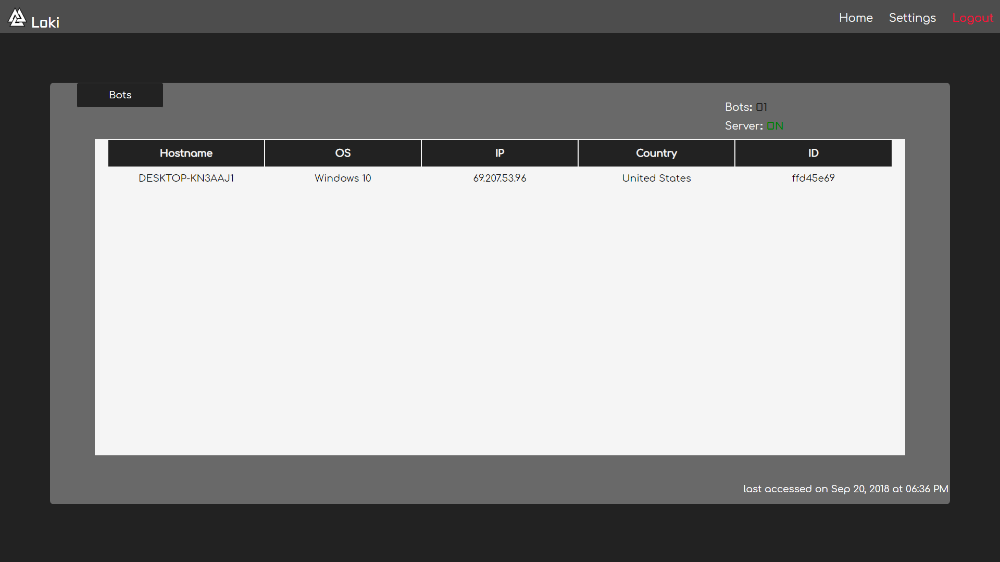

# Loki 

Loki is Remote Access Tool.<br/>
Loki uses **RSA-2048** with **AES-256** to keep your communication secure.<br/>
__Warning:__ DO NOT upload any samples generated by this program to online scanners.  



### Requirements
* Python **3.6.x**

### Server tested on
* Windows 10
* Kali Linux

### Bot tested on
* Windows 10
* Kali Linux

### Features
* Upload & Download
* Chrome Launching
* Persistence
* Screenshot
* Keylogger
* Ddos
* SFTP
* SSH

### Video
https://www.youtube.com/watch?v=aBEtwJ5gxSw

### Installation
```sh
pip install -r requirements.txt
```

### Server side
1) open /lib/const.py & configure your private and public IP's
2) start loki.py
3) navigate to http://127.0.0.1:5000
4) login, Username: loki Password: ikol
5) navigate to settings, selected server tab and start the server on the same IP as your private IP
6) Click the home button 

### Generate a payload
1) Navigate to the builder directory
2) Run: python builder.py -h

### After connection
1) You can click the hostname of the bot once it connects 
2) Explore 

### FYI
* The bot will call the server using the Public IP, not the private IP
* The bot will call the server using the port specified on the server tab
